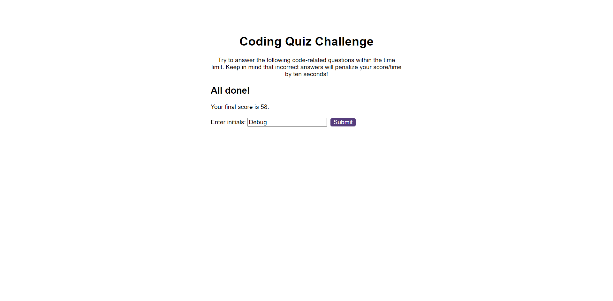

# :full_moon: About The Project

**Code-Quiz** is a Web App which contains some true or false questions that the user must answer in 60 seconds and the time remaining on the timer is the final score. This is the challenge of the week at the **edX Front-End Web Development Bootcamp**.

# :waxing_gibbous_moon: Features

- JavaScript
- Window localStorage

# :first_quarter_moon: Screenshot

# :waxing_crescent_moon: Acceptance Criteria

- A start button that when clicked a timer starts and the first question appears.
- Questions contain buttons for each answer.
- When answer is clicked, the next question appears.
- If the answer clicked was incorrect then subtract time from the clock.
- The quiz should end when all questions are answered or the timer reaches 0.
- When the game ends, it should display their score.
- Give the user the ability to save their initials and their score.

# :new_moon: Technologies

- HTML
- CSS
- JAVASCRIPT

# :globe_with_meridians: Website

- [Code-Quiz](https://whybruno.github.io/code-quiz)

# :copyright: Credits

N/A

# :registered: License

MIT License